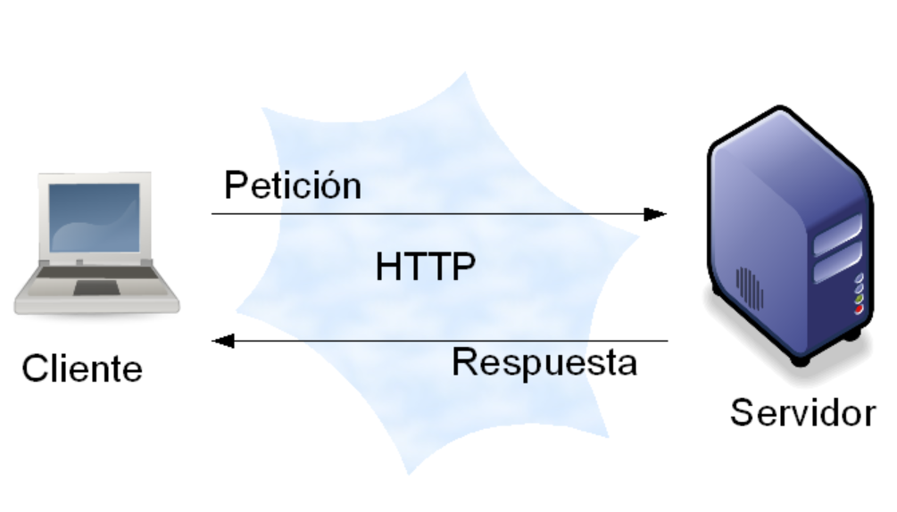
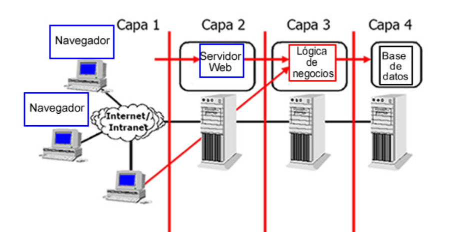
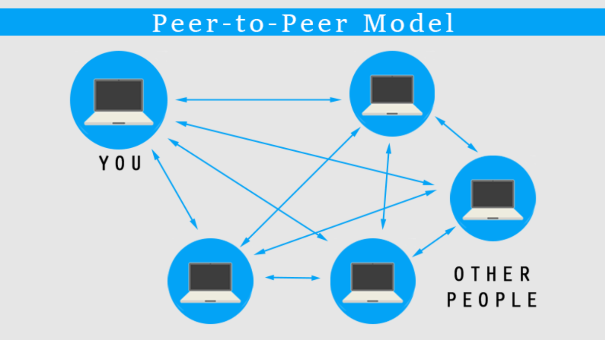
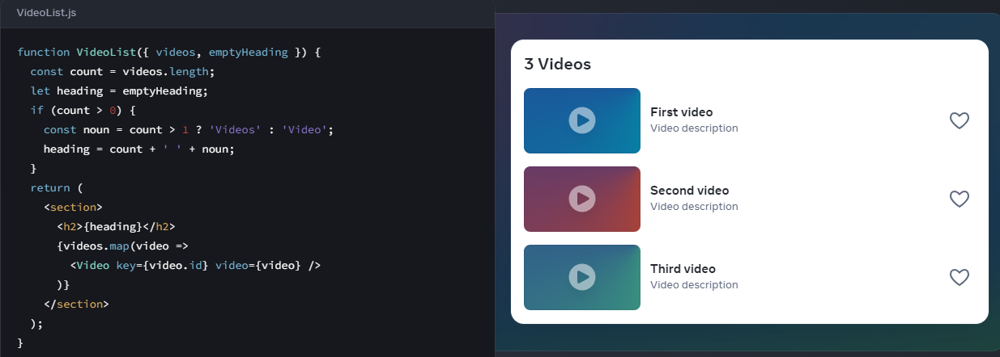

# Informe Técnico

## Análisis de los modelos de ejecución cliente/servidor

### Qué es la arquitectura cliente-servidor

El modelo cliente-servidor es una arquitectura ampliamente utilizada en el desarrollo de software, donde existen dos componentes principales, donde el cliente es el que pide solicitudes y el servidor se dedica a resolver las solicitudes del cliente,las procesa y se las devuelve con las respuestas correspondientes. 
Esta separación de responsabilidades permite que cada parte se enfoque en tareas específicas.

El modelo **cliente-servidor tradicional**, basado en solicitudes y respuestas, es el enfoque más común.
En este modelo el cliente realiza una petición HTTP, el servidor procesa y devuelve al cliente una respuesta.
Es un modelo síncrono donde el cliente espera la respuesta del servidor para poder continuar.
Un ejemplo típico es un navegador web que solicita un HTML a un servidor.
Un modelo sencillo de implementar y ampliamente utilizado, aunque presenta limitaciones de escalabilidad, ya que el servidor puede saturarse ante muchas peticiones.

**Arquitectura multicapa (n-Tier)**, donde el sistema se divide en varias capas, la de presentación (cliente), la de lógica de negocio ( servidor ) y la de datos ( base de datos ). A veces se añade una capa intermedia como un Middleware para mejorar la la separación de responsabilidades y la escalabilidad.
Este modelo es común en aplicaciones empresariales, donde cada capa realiza una función específica.
Aunque es mas compleja que el modelo **tradicional**, permite mayor escalabilidad y modularidad, ya que cada capa funciona de manera independiente.

En aplicaciones que requieren una comunicación en tiempo real, como los sistemas de chat o los juegos en línea, se utiliza el modelo **cliente-servidor en tiempo real**.
A diferencia del **modelo tradicional**, aquí el servidor envía actualizaciones constantes al cliente sin que este tenga que hacer solicitudes explícitas. Esto se logra mediante tecnologías como **WebSockets**, que permiten una conexión bidireccional y continua. Este modelo es ideal para aplicaciones donde la inmediatez es crucial, aunque requiere una gestión mas compleja de las conexiones permanentes y puede aumentar el uso de recursos en el servidor.

En sistemas como la compartición de archivos, el modelo **Peer-to-Peer (P2P)** permite que cada nodo funcione como cliente y servidor a la vez. Aquí, los recursos se distribuyen entre todos los nodos, eliminando la dependencia de un servidor central y mejorando la escalabilidad y la tolerancia a fallos. Un ejemplo clásico es **BitTorrent**, donde cada usuario actúa como servidor para otros usuarios, compartiendo partes del archivo que ya haya descargado. Aunque es un enfoque muy eficiente para distribuir recursos, plantea desafíos en cuanto a la integridad y seguridad de los datos.

Para este proyecto se va a usar el **modelo de ejecucíon tradicional** ya que tiene una combinación de simplicidad, bajo costo y fácil mantenimiento. Ideal para un tráfico moderado y cuando se quiere lanzar un producto rápido sin complicaciones innecesarias.

## Lenguajes de programación web

En el lado cliente los lenguajes de programación mas comunes son **JavaScript** y **TypeScript**. HTML y CSS no son lenguajes de programación! ya que no tienen funciones lógicas.

### JavaScript

**JavaScript** es un pilar fundamental a la hora de desarrollar en el lado cliente. Este lenguaje de programación permite agregar interactividad y dinamismo a las páginas web, como animaciones de elementos, actualización del contenido sin recargar la página o validar formularios. 
Es un lenguaje de programación o de secuencias de comandos que te permite implementar funciones complejas en páginas web. 
**JavaScript** es un lenguage interpretado ligero. El navegador web recibe el código **JavaScript** en su forma de texto original y ejecuta el script a partir de ahí. Desde un punto de vista técnico, la mayoría de los intérpretes de **JavaScript** modernos utilizan una técnica llamada compilación en tiempo real para mejorar el rendimiento, el código se compila en formato binario mas rápido mientras se está ejecutando el script. Sin embargo, **JavaScript** aún se considera un lenguaje interpretado, ya que la compilación se maneja en el entorno de ejecución, en lugar de antes.

### TypeScript

En 2012 fue el año en el que apareció **TypeScript**, una solución de Microsoft para el desarrollo de aplicaciones con **JavaScript** a gran escala, para ellos y para sus clientes. 
Está pensado para el desarrollo de aplicaciones robustas, implementando características en el lenguaje que nos permitan desarrollar herramientas más avanzadas para el desarrollo de aplicaciones.

**TypeScript** es un *superconjunto* de **JavaScript** que introduce tipado estático y características avanzadas orientadas a objetos. Se escribe en **TypeScript** y se transpila a JavaScript para que los navegadores lo interpreten, ya que **JavaScript** sigue siendo el único lenguaje nativo del navegador.
Se puede integrar **TypeScript** en proyectos existentes de **JavaScript** sin tener que reimplementar todo el código del proyecto en **TypeScript**.
Por si fuera poco, uno de los beneficios adicionales de esta característica del lenguaje, es que pone a disposición el enorme ecosistema de librerías y frameworks que existen para **JavaScript**. Con **Typescript** podemos desarrollas aplicaciones con React, Vue, Angular, etc.

### Conclusión

**JavaScript** es el lenguaje nativo del navegador, conocido por su simplicidad, flexibilidad y rapidez en el desarrollo, especialmente en proyectos pequeños o prototipos rápidos. Sin embargo, su naturaleza dinámica sin tipado estático puede llevar a errores difíciles de detectar y problemas de mantenibilidad en proyectos grandes. A pesar de su compatibilidad y su enorme ecosistema, **JavaScript** puede ser menos confiable en aplicaciones de gran escala debido a la falta de verificación de tipos en tiempo de compilación.

**TypeScript**, por otro lado, es un *superconjunto* de **JavaScript** que introduce tipado estático, lo que mejora la seguridad del código y ayuda a evitar errores en tiempo de ejecución. Es ideal para proyectos grandes, ya que facilita la mantenibilidad y permite el uso de características avanzadas como el autocompletado y el soporte para las últimas versiones de ECMAScript. Aunque su configuración y curva de aprendizaje son más complejas, **TypeScript** proporciona una mayor robustez y escalabilidad a largo plazo, a coste de un proceso de desarrollo más lento.

Este proyecto se va a desarrollar con **JavaScript**, ya que es conocido por el desarrollador y las ventajas que ofrece respecto a **TypeScript** son mayores para este proyecto.

### Cliente

En el lado cliente se usará HTML5, CSS3 y JAVASCRIPT.

- HMTL5: Se elige HTML5 para la estructura y el contenido de la página web. El esqueleto de la página que organiza elementos como 
textos, imágenes, formularios, enlaces, etc...

- CSS3: Usamos CSS para dar estilo y diseño a los elementos HTML. Controla la apariencia visual de la página, incluyendo colores, fuentes, márgenes, alineación y diseño responsivo ( adaptación a diferentes tamaños de pantalla ).

- JavaScript: El lenguaje de programación por exelencia en el lado cliente de una página web. Permite interactividad en la página web. Se usa para crear comportamientos dinámicos como la validación de formularios, control de eventos ( clicks, movimientos de ratón ), manipulación del DOM y comunicación asíncrona con el servidor mediante AJAX.

- AJAX: Permite que las páginas web se actualicen de forma asíncrona mediante el intercambio de datos con un servidor web detrás de la escena. Esto significa que es posible actualizar partes de una página web sin recargar toda la página.
AJAX no es un lenguaje de programación, solo usa una combinación de un objeto XMLHttpRequest incorporado en el navegador para solicitar datos a un servidor web.
Y se utiliza JavaScript y HMTL para mostrar o utilizar estos datos.

AJAX : https://www.w3schools.com/whatis/whatis_ajax.asp

### Servidor

En el lado servidor se utilizará Node.js y el framework Express.js

- Node.js: Es un entorno de ejecución para JavaScript que permite usarlo en el servidor. La ventaja de usar Node.js es que se ejecuta con un hilo (monohilo) con entradas y salidas asíncronas. Un proceso con un bucle que gestiona de forma asíncrona, todos los eventos.

- Express.js: Framework que sirve para crear APIs y rutas. Es simple y minimalista, significa que es fácil de usar, tiene una configuración muy simple y proporciona todas las herramientas necesarias para crear un backend.
Te da libertad para elegir los patrones y herramientas, cómo manejar rutas, controladores y la lógica de la aplicación.
Al estar construido en Node.js, aprovecha su arquitectura basada en eventos y asincronía, lo que permite manejar grander volúmenes de manera eficiente sin bloquear el servidor.

### Por qué he elegido estos modelos y no otros.

En el lado cliente se han elegido este modelo de ejecución porque son los principales para hacer una página web y estoy muy familiarizado con HTML5, CSS3 y JavaScript. 

### Uso de Frameworks en el lado cliente.

Existen frameworks para casi todo tipo de lenguajes o tecnologías, se van a repasar los diferentes frameworks existentes y la decisión de por qué no se van a usar frameworks en el lado Front End.

- CSS3: 
    - Bootstrap : Es un framework CSS desarrollado por Twitter en 2010 para estandarizar las herramientas de la compañía. En 2011 se transformó en código abierto. El framework combina CSS y JavaScript para estilizar los elementos en una página HTML. 
    Además de todas las características que ofrece el framework, su principa objetivo es permitir la construcción de sitios web responsive para dispositivos móviles.

    - Foundation: Framework para cualquier dispositivo, medio y accesibilidad, así se definen en su página web. Foundation hace que el diseño responsive sea fácil de realizar en sitios web, apps o incluso emails.
    Igual que bootstrap funcina con CSS y JavaScript haciendo que el maketado resulte mucho mas fácil de implementar.

    - Materialize: Framework de CSS responsivo, robusto y adaptable, donde las bases de diseño las hereda de Google y su estándar de desarrollo Material Design, que es el lenguaje visual que concentra los principios clásicos del bien diseño con la innovación de la tecnología u ciencia moderna para entornos móviles y para internet. 
    Acelera los tiempoos de desarrollo a través de la incorporación de componentes personalizados documentados de manera detallada junto con códigos específicos.

- JavaScript: 
    - React: Desarrollado por Facebook, es una librería de JavaScript de código abierto enfocada a la visualización. Esta tecnología nos permite el desarrollo de interfaces de usuario de forma sencilla. 
    Según una encuesta en StacOverflow, React es el framework más querido y más deseado este último año, además de ser el segundo más usado por detrás de jQuery.

    Fácil de integrar con otros frameworks o bibiliotecas.

    

    React usa una sintaxis de marcado JSX, hace que la lógica de renderizado sea mas fáciles de crear, mantener y eliminar al ser una extensión de la sintaxis de JavaScript.

    -Angular: Es un framework basado en componentes para crear aplicaciones web escalables, construida sobre TypeScript. 
    Tiene una amplia variedad de características, que incluyen enrutamiento, administración de formularios, comunicación cliente-servidor y mucho más. Su principal objetivo es desarrollar aplicaciones de una sola página. Goo

bootstap: https://rockcontent.com/es/blog/bootstrap/
foundation: https://get.foundation
materialize : https://openwebinars.net/blog/materialize-que-es-ventajas-y-primeros-pasos/
React: https://es.react.dev
Angular: 
servidor tiempo real : https://www.tooltyp.com/arquitectura-de-un-servicio-de-mensajeria-instantanea-como-whatsapp/
typescript : https://codigofacilito.com/articulos/typescript
javascript : https://developer.mozilla.org/es/docs/Learn/JavaScript/First_steps/What_is_JavaScript