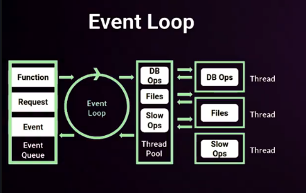

# Informe Técnico

## Análisis de los modelos de ejecución cliente/servidor

### Cliente

En el lado cliente se usará HTML5, CSS3 y JAVASCRIPT.

- HMTL5: Se elige HTML5 para la estructura y el contenido de la página web. El esqueleto de la página que organiza elementos como 
textos, imágenes, formularios, enlaces, etc...

- CSS3: Usamos CSS para dar estilo y diseño a los elementos HTML. Controla la apariencia visual de la página, incluyendo colores, fuentes, márgenes, alineación y diseño responsivo ( adaptación a diferentes tamaños de pantalla ).

- JavaScript: El lenguaje de programación por exelencia en el lado cliente de una página web. Permite interactividad en la página web. Se usa para crear comportamientos dinámicos como la validación de formularios, control de eventos ( clicks, movimientos de ratón ), manipulación del DOM y comunicación asíncrona con el servidor mediante AJAX.

- AJAX: Permite que las páginas web se actualicen de forma asíncrona mediante el intercambio de datos con un servidor web detrás de la escena. Esto significa que es posible actualizar partes de una página web sin recargar toda la página.
AJAX no es un lenguaje de programación, solo usa una combinación de un objeto XMLHttpRequest incorporado en el navegador para solicitar datos a un servidor web.
Y se utiliza JavaScript y HMTL para mostrar o utilizar estos datos.

AJAX : https://www.w3schools.com/whatis/whatis_ajax.asp

### Servidor

En el lado servidor se utilizará Node.js y el framework Express.js

- Node.js: Es un entorno de ejecución para JavaScript que permite usarlo en el servidor. La ventaja de usar Node.js es que se ejecuta con un hilo (monohilo) con entradas y salidas asíncronas. Un proceso con un bucle que gestiona de forma asíncrona, todos los eventos.

- Express.js: Framework que sirve para crear APIs y rutas. Es simple y minimalista, significa que es fácil de usar, tiene una configuración muy simple y proporciona todas las herramientas necesarias para crear un backend.
Te da libertad para elegir los patrones y herramientas, cómo manejar rutas, controladores y la lógica de la aplicación.
Al estar construido en Node.js, aprovecha su arquitectura basada en eventos y asincronía, lo que permite manejar grander volúmenes de manera eficiente sin bloquear el servidor.

### Por qué he elegido estos modelos y no otros.

