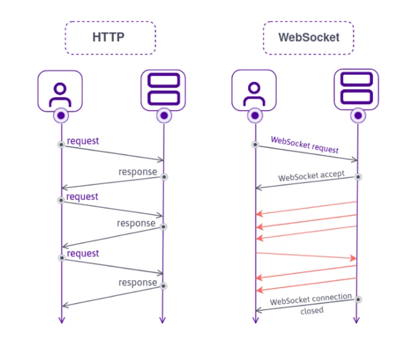
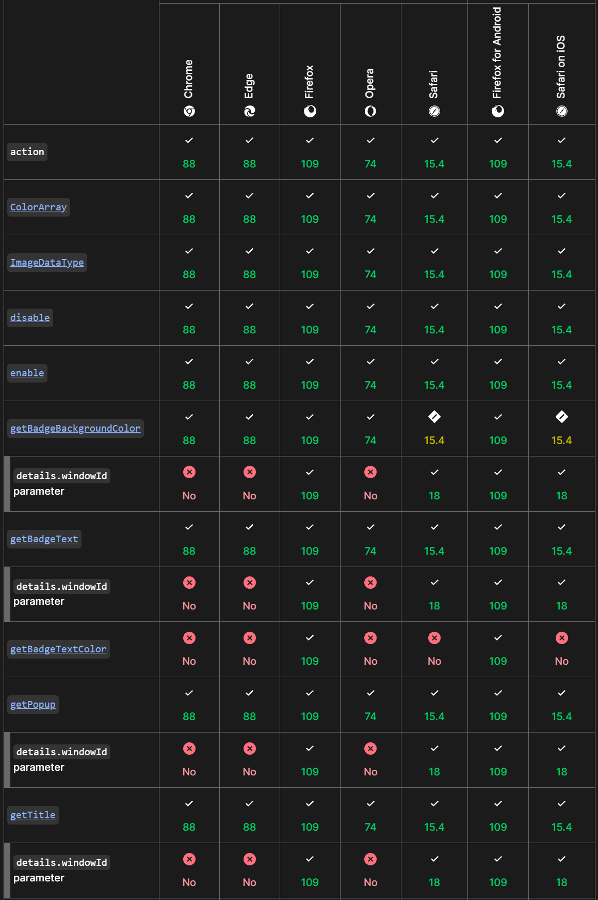
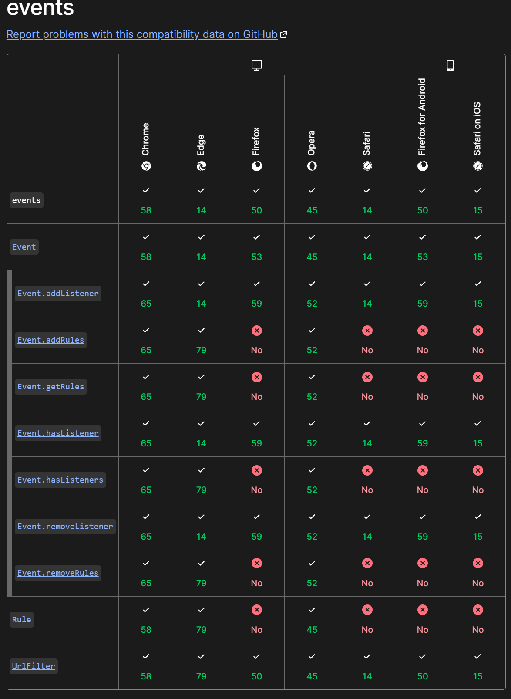

# Informe Técnico

## Análisis de los modelos de ejecución cliente/servidor

### Qué es la arquitectura cliente-servidor

El modelo cliente-servidor es una arquitectura ampliamente utilizada en el desarrollo de software, donde existen dos componentes principales, donde el cliente es el que pide solicitudes y el servidor se dedica a resolver las solicitudes del cliente,las procesa y se las devuelve con las respuestas correspondientes. 
Esta separación de responsabilidades permite que cada parte se enfoque en tareas específicas.

El modelo **cliente-servidor tradicional**, basado en solicitudes y respuestas, es el enfoque más común.
En este modelo el cliente realiza una petición HTTP, el servidor procesa y devuelve al cliente una respuesta.
Es un modelo síncrono donde el cliente espera la respuesta del servidor para poder continuar.
Un ejemplo típico es un navegador web que solicita un HTML a un servidor.
Un modelo sencillo de implementar y ampliamente utilizado, aunque presenta limitaciones de escalabilidad, ya que el servidor puede saturarse ante muchas peticiones.

**Arquitectura multicapa (n-Tier)**, donde el sistema se divide en varias capas, la de presentación (cliente), la de lógica de negocio ( servidor ) y la de datos ( base de datos ). A veces se añade una capa intermedia como un Middleware para mejorar la la separación de responsabilidades y la escalabilidad.
Este modelo es común en aplicaciones empresariales, donde cada capa realiza una función específica.
Aunque es mas compleja que el modelo **tradicional**, permite mayor escalabilidad y modularidad, ya que cada capa funciona de manera independiente.

En aplicaciones que requieren una comunicación en tiempo real, como los sistemas de chat o los juegos en línea, se utiliza el modelo **cliente-servidor en tiempo real**.
A diferencia del **modelo tradicional**, aquí el servidor envía actualizaciones constantes al cliente sin que este tenga que hacer solicitudes explícitas. Esto se logra mediante tecnologías como **WebSockets**, que permiten una conexión bidireccional y continua. Este modelo es ideal para aplicaciones donde la inmediatez es crucial, aunque requiere una gestión mas compleja de las conexiones permanentes y puede aumentar el uso de recursos en el servidor.

En sistemas como la compartición de archivos, el modelo **Peer-to-Peer (P2P)** permite que cada nodo funcione como cliente y servidor a la vez. Aquí, los recursos se distribuyen entre todos los nodos, eliminando la dependencia de un servidor central y mejorando la escalabilidad y la tolerancia a fallos. Un ejemplo clásico es **BitTorrent**, donde cada usuario actúa como servidor para otros usuarios, compartiendo partes del archivo que ya haya descargado. Aunque es un enfoque muy eficiente para distribuir recursos, plantea desafíos en cuanto a la integridad y seguridad de los datos.

Para este proyecto se va a usar el **modelo de ejecucíon tradicional** ya que tiene una combinación de simplicidad, bajo costo y fácil mantenimiento. Ideal para un tráfico moderado y cuando se quiere lanzar un producto rápido sin complicaciones innecesarias.

## Lenguajes de programación web

En el lado cliente los lenguajes de programación mas comunes son **JavaScript** y **TypeScript**. HTML y CSS no son lenguajes de programación! ya que no tienen funciones lógicas.

### JavaScript

**JavaScript** es un pilar fundamental a la hora de desarrollar en el lado cliente. Este lenguaje de programación permite agregar interactividad y dinamismo a las páginas web, como animaciones de elementos, actualización del contenido sin recargar la página o validar formularios. 
Es un lenguaje de programación o de secuencias de comandos que te permite implementar funciones complejas en páginas web. 
**JavaScript** es un lenguage interpretado ligero. El navegador web recibe el código **JavaScript** en su forma de texto original y ejecuta el script a partir de ahí. Desde un punto de vista técnico, la mayoría de los intérpretes de **JavaScript** modernos utilizan una técnica llamada compilación en tiempo real para mejorar el rendimiento, el código se compila en formato binario mas rápido mientras se está ejecutando el script. Sin embargo, **JavaScript** aún se considera un lenguaje interpretado, ya que la compilación se maneja en el entorno de ejecución, en lugar de antes.

### TypeScript

En 2012 fue el año en el que apareció **TypeScript**, una solución de Microsoft para el desarrollo de aplicaciones con **JavaScript** a gran escala, para ellos y para sus clientes. 
Está pensado para el desarrollo de aplicaciones robustas, implementando características en el lenguaje que nos permitan desarrollar herramientas más avanzadas para el desarrollo de aplicaciones.

**TypeScript** es un *superconjunto* de **JavaScript** que introduce tipado estático y características avanzadas orientadas a objetos. Se escribe en **TypeScript** y se transpila a JavaScript para que los navegadores lo interpreten, ya que **JavaScript** sigue siendo el único lenguaje nativo del navegador.
Se puede integrar **TypeScript** en proyectos existentes de **JavaScript** sin tener que reimplementar todo el código del proyecto en **TypeScript**.
Por si fuera poco, uno de los beneficios adicionales de esta característica del lenguaje, es que pone a disposición el enorme ecosistema de librerías y frameworks que existen para **JavaScript**. Con **Typescript** podemos desarrollas aplicaciones con React, Vue, Angular, etc.

### Conclusión

**JavaScript** es el lenguaje nativo del navegador, conocido por su simplicidad, flexibilidad y rapidez en el desarrollo, especialmente en proyectos pequeños o prototipos rápidos. Sin embargo, su naturaleza dinámica sin tipado estático puede llevar a errores difíciles de detectar y problemas de mantenibilidad en proyectos grandes. A pesar de su compatibilidad y su enorme ecosistema, **JavaScript** puede ser menos confiable en aplicaciones de gran escala debido a la falta de verificación de tipos en tiempo de compilación.

**TypeScript**, por otro lado, es un *superconjunto* de **JavaScript** que introduce tipado estático, lo que mejora la seguridad del código y ayuda a evitar errores en tiempo de ejecución. Es ideal para proyectos grandes, ya que facilita la mantenibilidad y permite el uso de características avanzadas como el autocompletado y el soporte para las últimas versiones de ECMAScript. Aunque su configuración y curva de aprendizaje son más complejas, **TypeScript** proporciona una mayor robustez y escalabilidad a largo plazo, a coste de un proceso de desarrollo más lento.

Este proyecto se va a desarrollar con **JavaScript**, ya que es conocido por el desarrollador y las ventajas que ofrece respecto a **TypeScript** son mayores para este proyecto.

## Tecnologías que se van a utilizar

### Cliente

En el lado cliente se usará HTML5, CSS3 y JAVASCRIPT.

- HMTL5: Se elige HTML5 para la estructura y el contenido de la página web. El esqueleto de la página que organiza elementos como 
textos, imágenes, formularios, enlaces, etc...

- CSS3: Usamos CSS para dar estilo y diseño a los elementos HTML. Controla la apariencia visual de la página, incluyendo colores, fuentes, márgenes, alineación y diseño responsivo ( adaptación a diferentes tamaños de pantalla ).

- JavaScript: El lenguaje de programación por exelencia en el lado cliente de una página web. Permite interactividad en la página web. Se usa para crear comportamientos dinámicos como la validación de formularios, control de eventos ( clicks, movimientos de ratón ), manipulación del DOM y comunicación asíncrona con el servidor mediante AJAX.

- AJAX: Permite que las páginas web se actualicen de forma asíncrona mediante el intercambio de datos con un servidor web detrás de la escena. Esto significa que es posible actualizar partes de una página web sin recargar toda la página.
AJAX no es un lenguaje de programación, solo usa una combinación de un objeto XMLHttpRequest incorporado en el navegador para solicitar datos a un servidor web.
Y se utiliza JavaScript y HMTL para mostrar o utilizar estos datos.

AJAX : https://www.w3schools.com/whatis/whatis_ajax.asp

#### Uso de Frameworks en el lado cliente.

Existen frameworks para casi todo tipo de lenguajes o tecnologías, se van a repasar los diferentes frameworks existentes y la decisión de por qué no se van a usar frameworks en el lado Front End.

- CSS3: 
    - Bootstrap : Es un framework CSS desarrollado por Twitter en 2010 para estandarizar las herramientas de la compañía. En 2011 se transformó en código abierto. El framework combina CSS y JavaScript para estilizar los elementos en una página HTML. 
    Además de todas las características que ofrece el framework, su principa objetivo es permitir la construcción de sitios web responsive para dispositivos móviles.

    - Foundation: Framework para cualquier dispositivo, medio y accesibilidad, así se definen en su página web. Foundation hace que el diseño responsive sea fácil de realizar en sitios web, apps o incluso emails.
    Igual que bootstrap funcina con CSS y JavaScript haciendo que el maketado resulte mucho mas fácil de implementar.

    - Materialize: Framework de CSS responsivo, robusto y adaptable, donde las bases de diseño las hereda de Google y su estándar de desarrollo Material Design, que es el lenguaje visual que concentra los principios clásicos del bien diseño con la innovación de la tecnología u ciencia moderna para entornos móviles y para internet. 
    Acelera los tiempoos de desarrollo a través de la incorporación de componentes personalizados documentados de manera detallada junto con códigos específicos.

- JavaScript: 
    - React: Desarrollado por Facebook, es una librería de JavaScript de código abierto enfocada a la visualización. Esta tecnología nos permite el desarrollo de interfaces de usuario de forma sencilla. 
    Según una encuesta en StacOverflow, React es el framework más querido y más deseado este último año, además de ser el segundo más usado por detrás de jQuery.

    Fácil de integrar con otros frameworks o bibiliotecas.

    

    React usa una sintaxis de marcado JSX, hace que la lógica de renderizado sea mas fáciles de crear, mantener y eliminar al ser una extensión de la sintaxis de JavaScript.

    - Angular: Es un framework basado en componentes para crear aplicaciones web escalables, construida sobre TypeScript. 
    Tiene una amplia variedad de características, que incluyen enrutamiento, administración de formularios, comunicación cliente-servidor y mucho más. Su principal objetivo es desarrollar aplicaciones de una sola página. Goo

### Servidor

En el lado servidor se utilizará Node.js y el framework Express.js

- Node.js: Es un entorno de ejecución para JavaScript que permite usarlo en el servidor. La ventaja de usar Node.js es que se ejecuta con un hilo (monohilo) con entradas y salidas asíncronas. Un proceso con un bucle que gestiona de forma asíncrona, todos los eventos.

#### Uso de frameworks en el lado servidor

- Express.js: Framework que sirve para crear APIs y rutas. Es simple y minimalista, significa que es fácil de usar, tiene una configuración muy simple y proporciona todas las herramientas necesarias para crear un backend.
Te da libertad para elegir los patrones y herramientas, cómo manejar rutas, controladores y la lógica de la aplicación.
Al estar construido en Node.js, aprovecha su arquitectura basada en eventos y asincronía, lo que permite manejar grander volúmenes de manera eficiente sin bloquear el servidor.

### Por qué he elegido estos modelos y no otros.

En el lado del cliente, se ha elegido este modelo de ejecución debido a que HTML5, CSS3 y **JavaScript** son esenciales para construir una página web, y además, estoy muy familiarizado con estas tecnologías sin usar ningún tipo de framework ( se podrá implementar React o Angular si hicieran falta en el desarrollo ). En cuanto al backend, se ha optado por Node.js junto con el framework Express.js para crear el servidor, ya que en mis prácticas de DAM utilicé este método en una empresa, y descubrí que es una solución sencilla, diferente y efectiva para desarrollar un backend web.

### Integración de lenguajes de marcas con lenguajes de programación de clientes web

En una aplicación web, los lenguajes de marcas, como HTML, y los lenguajes de programación, como **JavaScript**, se integran de manera complementaria para crear una experiencia interactiva y funcional en el lado cliente. 

HTML proporciona la estructura y el contenido básico de una página web a través de etiquetas y atributos que organizan elementos como encabezados, párrafos, imágenes, etc. HTML por sí solo es estático y no puede responder dinámicamente a las interacciones del usuario.

Aquí es donde **JavaScript** entra en acción, permitiendo la interacción y manipulación del contenido de HTML de manera dinámica. **JavaScript** accede y modifica los elementos del DOM ( Document Object Model ), que es una representación interna de la estructura HTML en el navegador. 
Con **JavaScript** puedes cambiar el contenido de una página sin recargarla, crear carruseles, galería de imágenes, manejar eventos como clicks, etc.

### Herramientas de programación para clientes web.

Existen una gran variedad de herramientas de programación para clientes web. Estas herramientas incluyen editores de código, bibliotecas y frameworks, herramientas de depuración y otras utilidades que facilitan el flujo de trabajo.

Este proyecto se va a desarrollar con el entorno Visual Studio Code tanto como en el lado Cliente como en el lado Servidor. 
Visual Studio Code es uno de los editores más populares y ampliamente utilizado por desarrolladores web. Ofrece soporte para extensiones, depuración y una gran integración con Git.
Es realmente ligero y rápido en comparación a los demás IDEs, como IntelliJ. Consume pocos recursos y acepta múltiples lenguajes, ya que en este proyecto se va a trabajar con varios, como HTML ( lenguaje de marcas ), CSS y **JavaScript**. Ofrece una amplia colección de extensiones gratuitas, como linters, autocompletado para diversos lenguajes, Live Server , etc.

## Compatibilidad entre navegadores

Los diferentes navegadores manejan **JavaSctip**  a través de motores especializados, como V8 en Chrome y Edge, SpiderMonkey en Firefox y JavaScriptCore en Safari.
Estas diferencias en los motores afectan al rendimiento y la compatibilidad de las aplicaciones web. Algunos navegadores ejecutan operaciones JavaScript más rápido que otros, y llas características más recientes del lenguaje pueden no estar disponible en versiones antiguas o desactualizadas.

En cuanto a HTML y CSS, los navegadores modernos tienen un soporte generalizado para HTML5 y CSS3, pero pueden surgir variaciones en la representación visual y en el soporte de propiedades avanzadas como Flexbox, Grid y animaciones. Estas diferencias pueden afectar la experiencia de usuario y el diseño visual de las aplicaciones. 

A continuación se expone un ejemplo visual de algunas de las compatibilidades e incompatibilidades de los principales navegadores con **JavaScript**

En este ejemplo podemos observar que  *details.windowId* no es compatible con Chrome, Edge u Opera, pero sí es compatible con Firefox y Safari.

Events tambien tiene algunos métodos que no son compatibles con algunos navegadores, como por ejemplo *Events.addRules* que es incompatible con Firefox y Safari.
Y como estos muchos ejemplos más que se pueden ver en [compatibilidad de navegadores con la API de JavaScript](https://developer.mozilla.org/es/docs/Mozilla/Add-ons/WebExtensions/Browser_support_for_JavaScript_APIs#events)

## Análisis de Mercado

### Competencia existente

En el competitivo mercado de plataformas para compartir ofertas, el principal competidor es Chollómetro. Esta plataforma se ha consolidado como un referente, permitiendo a los usuarios compartir y descubrir ofertas de una amplia variedad de productos. En 2023, Chollómetro alcanzó más de 424 millones de visitas, lo que refleja su notable popularidad y la eficacia de su modelo de negocio centrado en la comunidad. Una de sus características distintivas es el enfoque en la interacción social, donde los usuarios pueden comentar y calificar las ofertas y a otros usuarios, fomentando así un entorno dinámico y colaborativo​.

Otras aplicaciones como Atrápalo y Cupones.es también operan en este espacio, aunque no tienen la misma relevancia que Chollómetro. Atrápalo se enfoca principalmente en viajes y ocio, mientras que Cupones.es está más centrado en cupones de descuento. Esta especialización limita su alcance y diversidad en comparación con la propuesta de tu aplicación, que busca abarcar un espectro más amplio de productos y servicios​.

### Diferenciación y nuevos valores

Nuestra propuesta se diferencia en varios aspectos clave que aportan valor a la comunidad. En primer lugar, el enfoque en la comunidad permite una interacción más rica, donde los usuarios pueden calificar no solo las ofertas, sino también a otros miembros de la plataforma. Esto fomenta un ambiente de confianza y credibilidad, incentivando la participación activa.

Además, la opción de cuentas Premium ofrece beneficios adicionales que pueden mejorar la experiencia del usuario. Estas cuentas permiten realizar más publicaciones y acceder a herramientas analíticas que ayudan a optimizar las ofertas, brindando un valor agregado que no se encuentra en plataformas competidoras​.

Otro aspecto innovador es la capacidad de facilitar colaboraciones entre empresas y usuarios Premium. Esta funcionalidad no solo abre oportunidades de monetización para los usuarios, sino que también enriquece el contenido disponible en la plataforma. A diferencia de la competencia, que no ha implementado esta estrategia de manera efectiva, tu propuesta ofrece un ecosistema más integrado que beneficia tanto a consumidores como a marcas.

Finalmente, al recompensar a los usuarios más calificados, se crea una cultura de participación activa que puede incrementar la retención y el uso regular de la aplicación. Esta estrategia de gamificación es esencial para mantener un alto nivel de engagement y motivar a los usuarios a interactuar continuamente.

### Bibliografía

- bootstap: https://rockcontent.com/es/blog/bootstrap/
- foundation: https://get.foundation
- materialize : https://openwebinars.net/blog/materialize-que-es-ventajas-y-primeros-pasos/
- React: https://es.react.dev
- Angular: https://angular.dev/
- servidor tiempo real : https://www.tooltyp.com/arquitectura-de-un-servicio-de-mensajeria-instantanea-como-whatsapp/
- typescript : https://codigofacilito.com/articulos/typescript
- javascript : https://developer.mozilla.org/es/docs/Learn/JavaScript/First_steps/What_is_JavaScript
- compatibilidad navegadores : https://codelucky.com/javascript-browser-support/  https://developer.mozilla.org/es/docs/Mozilla/Add-ons/WebExtensions/Browser_support_for_JavaScript_APIs
- análisis de mercado : https://elcandelerotecnologico.com/2024/02/19/chollometro-bate-records-mas-de-424-millones-de-visitas-a-la-plataforma-de-ofertas-en-2023/ 
https://appmarketingnews.io/hablamos-con-el-equipo-de-chollometro-la-app-colaborativa-de-ofertas-y-descuentos/
